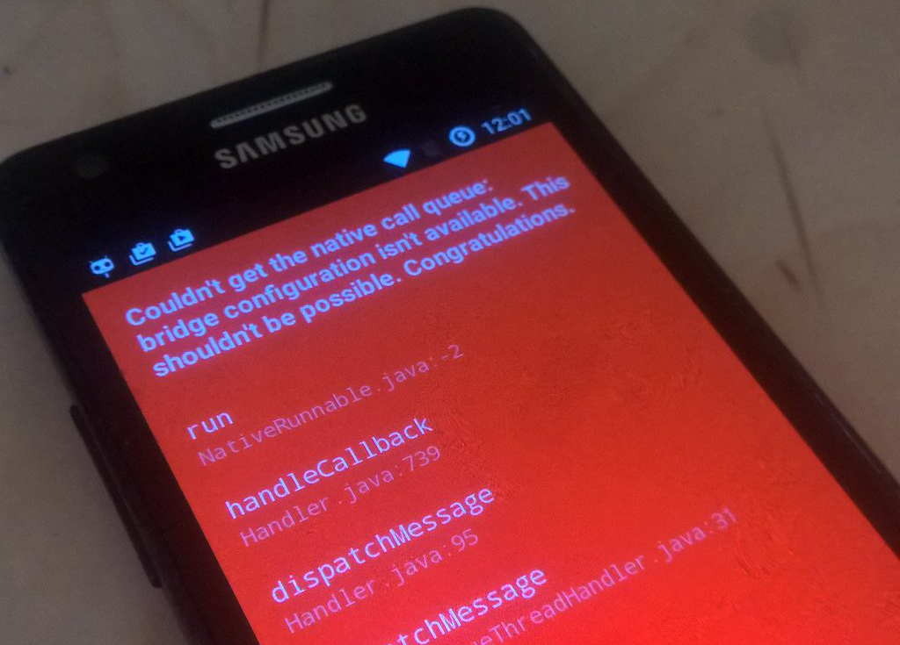

+++
title = "Expect the unexpected"
date = 2016-06-13
[taxonomies]
tags = ["xcode",
  "syncthing-bar",
  "error management",
  "swift",
  "travis",
  "debugging"]
+++

Slowly this blog is turning into to a xcode rant blog. It happened again. I very seldom do any Mac development but when I do there is fail.

When I started [syncthing-bar](https://github.com/m0ppers/syncthing-bar) and implemented its first (and only :D) unit test there wasn't any image for travis that supported xcode, swift etc. After a recent pull request I rechecked and I saw that much has happened since my last check and they now have proper images for xcode. While I still wonder why you still have to provide `objective-c` as [language](https://github.com/m0ppers/syncthing-bar/blob/master/.travis.yml#L1) to the .travis.yml everything seemed fine. And then the stack was failing me again:

```
2016-06-13 22:01:23.926 syncthing-bar[2027:58722] ApplePersistenceIgnoreState: Existing state will not be touched. New state will be written to /var/folders/2w/pk545zls3_l24mz6plrf8nw40000gn/T/koeln.mop.syncthing-bar.savedState
fatal error: unexpectedly found nil while unwrapping an Optional value
** TEST FAILED **
```

This is Swift's variant of a null pointer exception.

So obviously I was expecting my test to be broken but already I wondered: Why is there no detail information at all and why is it not reproducable locally? I made a few tests and googled a bit and apparently there were some hints that xctool (that will execute your tests) was broken in some cases and so I replaced it with xcodebuild again.

Same error. So I tried playing with the command line options. Same error. Still no deeper insight. Then I emptied my tests. Same error.

Then I even tried a travis alternative (https://www.bitrise.io/) for the mac ecosystem and again: Same error with same level of detail.

After finally cross checking with a colleague I finally came to the conclusion that it must be something inside my working directory and finally after cloning into a separate directory I could reproduce the error.

So what is going on?

After checking the directory differences using

```
hans-guenther:syncthing-bar-fail mop$ diff -r . ../syncthing-bar
```

I finally found the reason.

For a release I am bundling the project together with a syncthing binary. So this binary is referenced in the project but for obvious reasons I am not checking it in.

Apparently even though the testcode is not at all related to the binary it seems to be required for the testcode to run. It is interesting however that this subtle thing is raising an internal error with no chance to debug it :|.

The unexpected was not expected.

The same is obviously true for my debugging attempts because I expected my working directory to be clean.

I hope to finish a simple react-native project soon. This will be the next rant post.

Some (very related) sneak preview:


