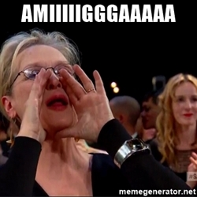

+++
title = "Making of Wirklichkeitssteuerungsgeraet"
date = 2017-09-28
[taxonomies]
tags = ["hardware",
  "lowlevel",
  "motorcycle",
  "amiga",
  "demoscene",
  "presentation"]
+++
Somebody today asked me for the slides of `Wirklichkeitssteuerungsgeraet` which I held several months ago at the [DevHouseFriday](https://www.meetup.com/de-DE/DevHouseFriday-Chillout/) meetup.
Apparently I never crossposted this here and as a result it is not even googable. Also this is the super cheap solution of doing the first blog post of the year :D

`Wirklichkeitssteuerungsgeraet` won the 1st prize (wild) at [Revision 2017](http://www.pouet.net/prod.php?which=69676).

So here is the link to the presentation:

https://m0ppers.github.io/wirklichkeitssteuerungsgeraet-presentation/

Currently my AMIIIIGAAAAA efforts are slightly stalled due to other stuff in the works and missing the evoke deadline.
I hope I can show some new stuff later this year or next year :D

